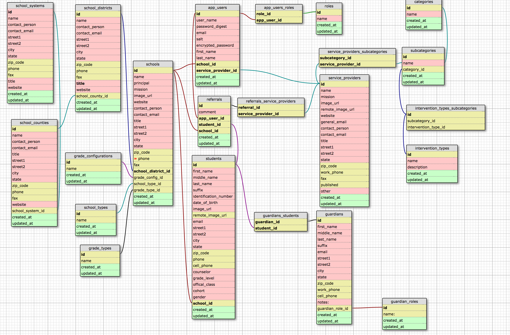

Steps to Dermatobia and Jason to have a successful start:
1. Delete Development.log file
2. rake db:drop
3. bundle install
4. rake db:create
5. rake db:migrate
6. rake db:seed

Read the 'vendore/associations.rb' file to understand relationships.

#Sarah wrote this for anyone else who wants to join
Initial setup

run
```
bundle install
rake db:create
rake db:migrate
rake db:seed
```


# Database Model on 090714



# Model on 090414


